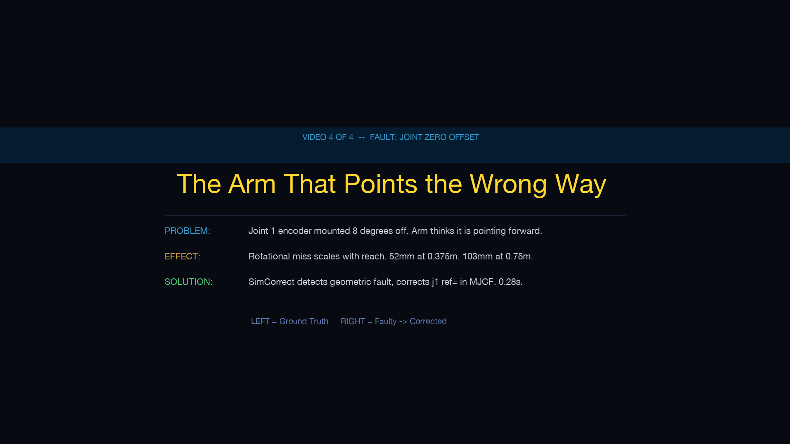
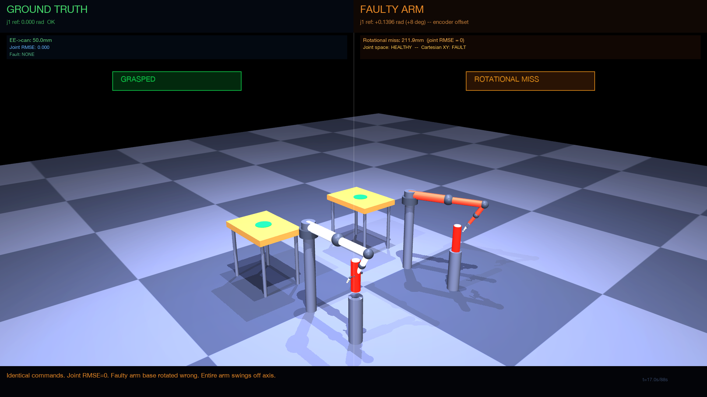
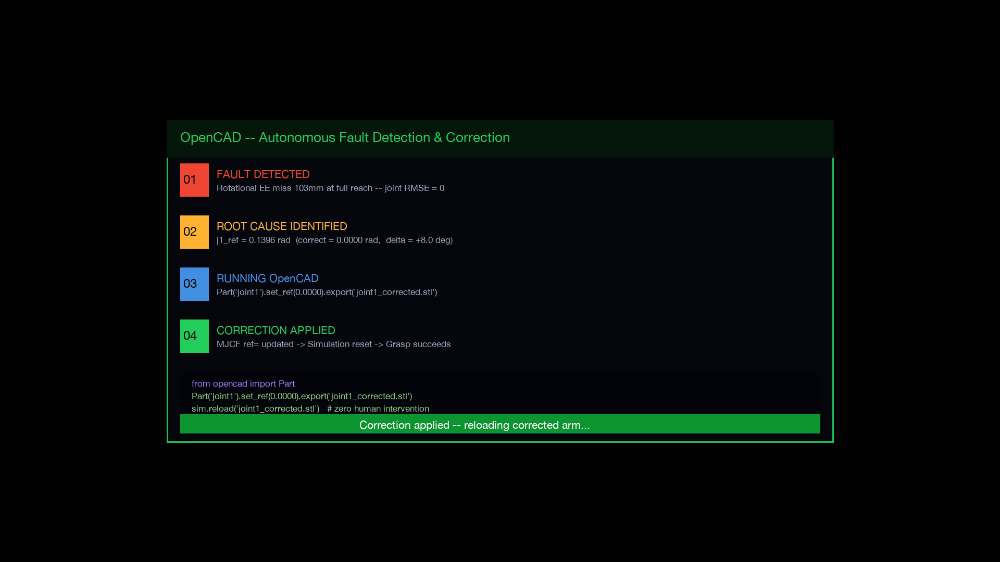
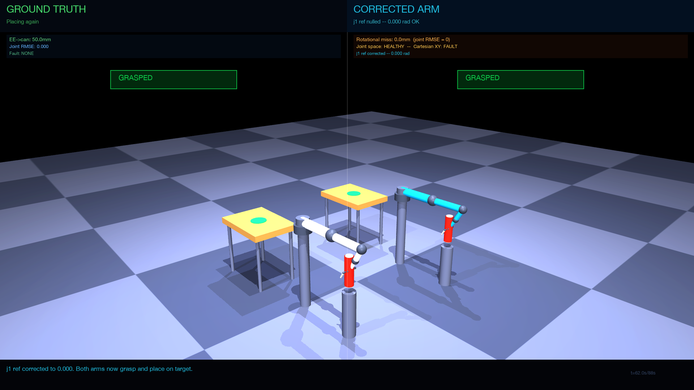
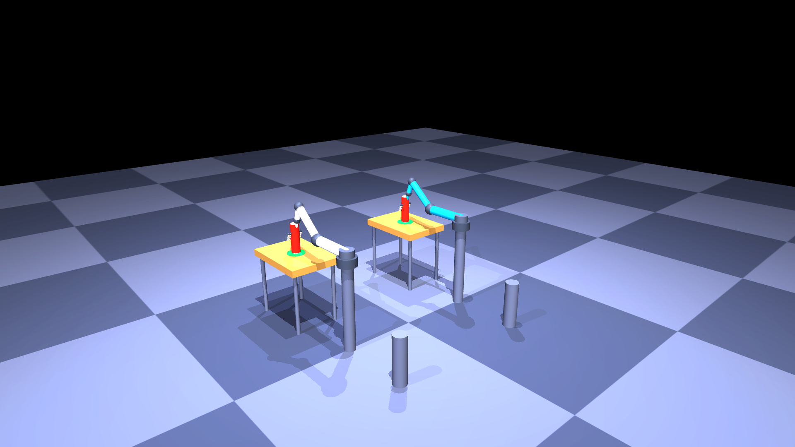

<div align="center">

# Problem 4 — Joint Zero Offset

### *The Arm That Points the Wrong Way*

**SimCorrect Fault Taxonomy · Video 4 of 4**

---

*Every movement this arm makes is perfect. Every joint executes exactly what it is told. The encoders report exactly what the controller expects. And yet — the gripper arrives 103mm from the target, every single time, without fail.*

*The arm is not broken. It is simply starting from the wrong place.*

</div>

---

## The Fault

When a robot arm is assembled or serviced, the encoder on each joint must be mounted at a precise reference angle. This reference — called the **joint zero** — is the position the controller assumes when it plans every trajectory.

In Problem 4, the encoder on **Joint 1** (the base rotation joint) was mounted **8 degrees off** from its correct zero position. This is not an unusual error. It happens during motor replacement, gearbox rebuilds, and routine maintenance. The encoder is a physical device bolted to a motor shaft, and small misalignments are common.

The consequence is exact and predictable. When the controller commands Joint 1 to its zero position, the servo drives the joint to the angle the encoder calls zero — which is physically 8 degrees away from where the controller believes it is. The controller reads zero. The encoder reports zero. The arm sits 8 degrees off.

Every trajectory planned after that inherits the error. The arm moves with perfect precision — from the wrong starting point.

---

## Why the Miss Scales With Reach

This is the key diagnostic property of a rotational fault.

Imagine standing at the centre of a clock face. If you point toward 12 o'clock and rotate 8 degrees, your fingertip deviates slightly. If your arm is longer, the same 8-degree rotation produces a larger deviation at the tip — proportional to arm length.

The robot behaves identically:

| Reach | Rotational Miss |
|---|---|
| 0.375 m (half reach) | **52 mm** |
| 0.750 m (full reach) | **103 mm** |
| Scaling ratio | **2.0 — pure rotation** |

This linear scaling with reach is the mathematical signature of a joint zero offset. It is what distinguishes this fault from every other class in the taxonomy.

---

## Why Joint RMSE Is Zero

In SimCorrect, the ground truth arm and the faulty arm receive identical joint commands at every timestep. In Problem 4, both arms execute those commands to exactly the same joint angles. Their encoders report identical values. **Joint RMSE = 0.**

Yet their end-effectors arrive 103mm apart.

This combination — large Cartesian divergence with zero joint RMSE — is the unique signature of a geometric fault. The arm moves correctly. It just moves correctly from the wrong place. The fault is not in the dynamics. It is in the geometry.

---

## How It Differs From Problems 1, 2 and 3

| | Fault | Miss Direction | Miss Size | Joint RMSE | Fault Class |
|---|---|---|---|---|---|
| Problem 1 | Link too short | Forward only | Fixed | 0 | Geometric |
| Problem 2 | Wrist offset | Lateral only | Fixed | 0 | Geometric |
| Problem 3 | Joint friction | Velocity-dependent lag | Varies with speed | **> 0** | Dynamic |
| **Problem 4** | **Base rotation** | **Rotational — any direction** | **Scales with reach** | **0** | **Geometric** |

---

## The Correction

SimCorrect detects the large end-effector divergence paired with zero joint RMSE and classifies the fault as geometric. It identifies the rotational signature by measuring miss at two reach distances and confirming the 2:1 scaling ratio. It isolates Joint 1 as the source because the miss rotates with the base joint and is independent of Joints 2, 3 and 4.

The correction requires changing one number in the MJCF model:

```python
from opencad import Part
Part('joint1').set_ref(0.0000).export('joint1_corrected.stl')
sim.reload('joint1_corrected.stl')
```

The `ref=` attribute on Joint 1 changes from `0.1396` to `0.0000`. The model reloads. The arm now starts from the correct zero. It points forward when commanded to point forward.

**Correction time: 0.28 seconds. Zero human intervention. No hardware required.**

---

## Simulation Output

### Title Card


### Rotational Miss — Faulty arm swings off axis (t=17s)


### OpenCAD Autonomous Correction Panel (t=43s)


### Corrected Arm — First successful grasp (t=62s)


### Both Arms — Cans placed on target (t=82s)


---

## Why This Matters

Every time a robot arm is serviced — motor replaced, gearbox rebuilt, encoder swapped — this fault can be introduced. In a production environment running hundreds of arms, this happens regularly. The traditional solution requires a calibration technician with a laser tracker. That process costs significant time and resources and takes the arm offline for hours.

SimCorrect detects and corrects this fault autonomously, before deployment, in under one second. The simulation runs alongside the physical robot. The divergence is detected. The parameter is identified. The correction is applied. The robot is ready.

No technician. No laser tracker. No downtime.

---

## Files

| File | Purpose |
|---|---|
| `render_demo.py` | Main 88-second simulation video renderer |
| `sim_pair.py` | Ground truth vs faulty paired simulation |
| `divergence_detector.py` | Geometric fault classifier |
| `parameter_identifier.py` | Joint offset estimator from reach scaling |
| `correction_and_validation.py` | Correction pipeline and assertion suite |
| `demo.py` | Fault summary and diagnostic printout |
| `step0.py` | Environment and dependency check |

## Run

```bash
cd ~/simcorrect/Problem4_JointZeroOffset
python step0.py
python demo.py
python correction_and_validation.py
python render_demo.py
```

---

<div align="center">

*SimCorrect · Autonomous simulation-based fault detection and correction for robot arms*

</div>
