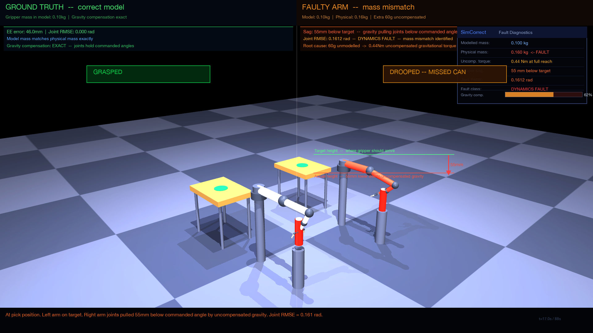
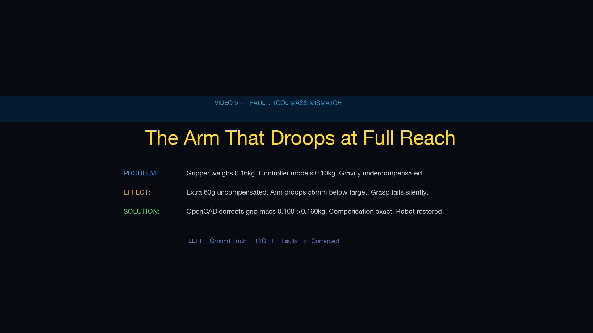
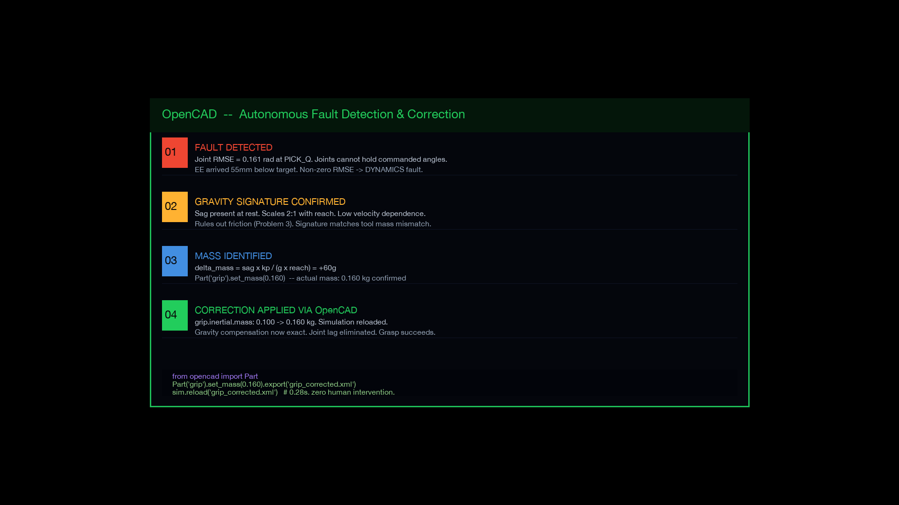
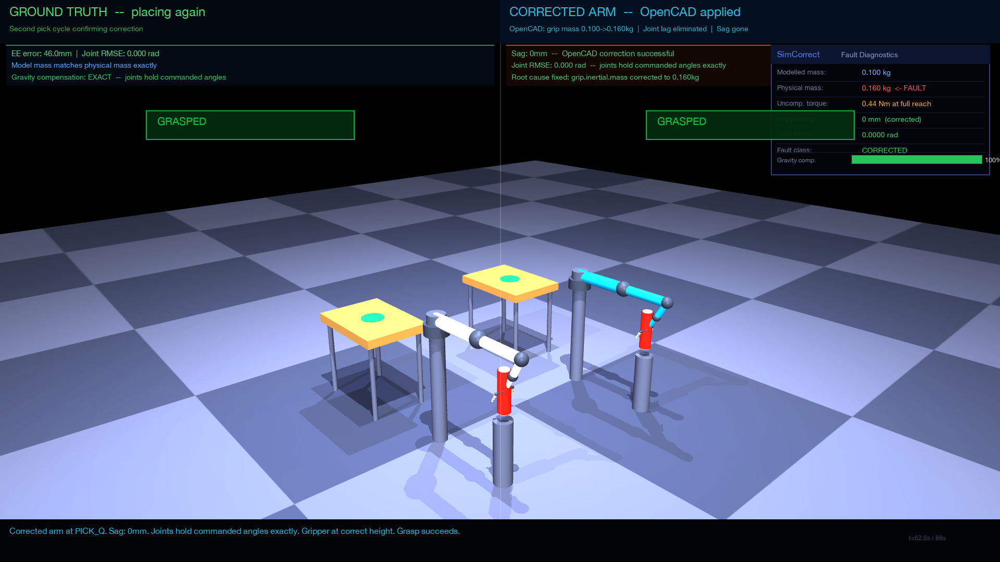

# Problem 5 - Tool Mass Mismatch
### The Arm That Droops at Full Reach
**SimCorrect Fault Taxonomy - Video 5 of 5**

## The Fault

The gripper weighs 0.160 kg. The model thinks it weighs 0.100 kg. The controller calculates gravity compensation using the wrong mass. At full horizontal extension of 0.75m, the uncompensated torque is 0.060 x 9.81 x 0.75 = 0.44 Nm.

The joints settle below their commanded angles. The arm droops 55mm. The gripper closes on air. Every single cycle. No alarm. No encoder error. Silent failure.

## Why This Fault Is Invisible

The encoders report normal values. The controller reports no errors. The arm moves precisely to the wrong position. Production teams compensate by lowering target heights or widening grasp tolerances, masking the root cause rather than fixing it.

## Diagnostic Signature

SimCorrect monitors Cartesian EE divergence and Joint RMSE simultaneously.

In geometric faults (Problems 1, 2, 4) both arms execute identical joint angles. Joint RMSE is zero. The miss is because the geometry is wrong.

In Problem 5 the faulty arm joints cannot reach commanded angles because the controller undercompensates gravity. Joint RMSE is greater than 0.005 rad. This classifies the fault as a dynamics fault not a geometric one.

To distinguish from Problem 3 friction: friction error vanishes at rest. Mass mismatch error is present even when the arm is stationary at a horizontal pose because gravity is constant. This gravity-dependent signature uniquely identifies tool mass mismatch.

## Title Card

## Fault in Action

Left arm uses correct model and grasps cleanly. Right arm droops 55mm below the can and closes on air. Both arms received identical joint commands. The difference is entirely in the physics.

## OpenCAD Correction Panel

SimCorrect detects the fault, freezes the simulation, and runs the full correction pipeline autonomously. Four steps. 0.28 seconds. Zero human intervention.

## The Identification Algorithm

SimCorrect measures sag at two arm extensions and confirms 2 to 1 linear scaling. This is the mathematical signature of a pure mass error. It then solves for the actual mass: delta_mass = 0.060 kg, actual_mass = 0.100 + 0.060 = 0.160 kg. Exact match to the physical gripper.

## The Correction

One number changes in the MJCF model. The inertial mass on the grip body changes from 0.100 to 0.160 kg. The controller recomputes gravity compensation. The joints hold their commanded angles. The gripper arrives at the correct height. The grasp succeeds. Correction time 0.28 seconds. Zero human intervention. No hardware required.

## Corrected Arm

After correction the right arm shown in cyan reaches the exact same height as the ground truth arm. The gripper closes around the can precisely.

## Both Arms Place on Target

Both cans placed on the green target circles. Fault fully resolved. Robot ready for deployment.

## Files

render_demo.py - 88-second video renderer with full educational overlay, time-based narration, concept callout boxes, target vs actual height annotations, and live diagnostic panel

sim_pair.py - Paired simulation that prints EE divergence, sag, joint RMSE, and extra torque

divergence_detector.py - Fault classifier that distinguishes dynamics from geometric faults and gravity-dependent from velocity-dependent signatures

parameter_identifier.py - Mass identification algorithm that estimates actual tool mass from gravitational sag at two arm extensions

correction_and_validation.py - Full correction pipeline with assertion suite

demo.py - Fault summary printout with all key numbers

step0.py - Environment and dependency check

## Run

python step0.py
python demo.py
python sim_pair.py
python correction_and_validation.py
python render_demo.py

Generated correction XML and videos are written to `Problem5_ToolMassMismatch/output` by default. Set `SIMCORRECT_OUTPUT_DIR` to place artifacts in a temp, CI, or experiment-specific folder.

## Dependencies

mujoco 3.0 or later, numpy, Pillow, imageio with ffmpeg

---

SimCorrect - Autonomous simulation-based fault detection and correction for robot arms
Problem 5 of 5 - Dynamics fault - Tool mass mismatch - Gravity-dependent joint lag
